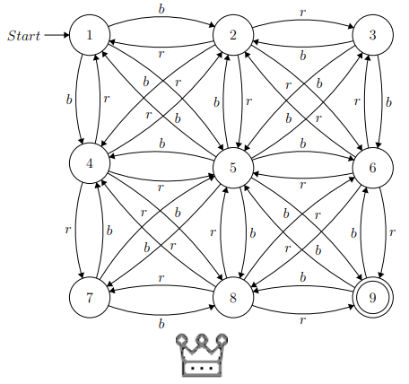
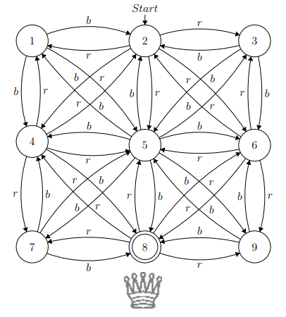
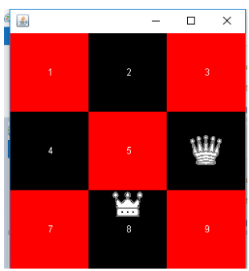
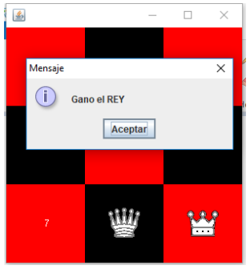

# Automata-Chess-Animation

A simple problem: Suppose you are on a 3x3 chessboard being the king's piece, and it must come from one corner to another. Easy, but now let's put another restriction: you can only move as a function of one string of r’s and b’s, moving only to red boxes with the ’r’ and to black squares with the 'b's. The problem is complicated when you want to obtain all the possible routes of a specific string for a specific token. It's a combinatorial problem, where in the smallest string like ’rr’ we only get one route, but in one of size 4 'rbbr' you can get 24 routes different of which only 4 reach the desired objective.
To solve this we turned to an old friend, the AFND. This machines allow us to solve the problem of which routes reach the goal, having to build an Automata for each token in play.
In this program there're 2 tokens and the Automatas are:

And the animation goes:

